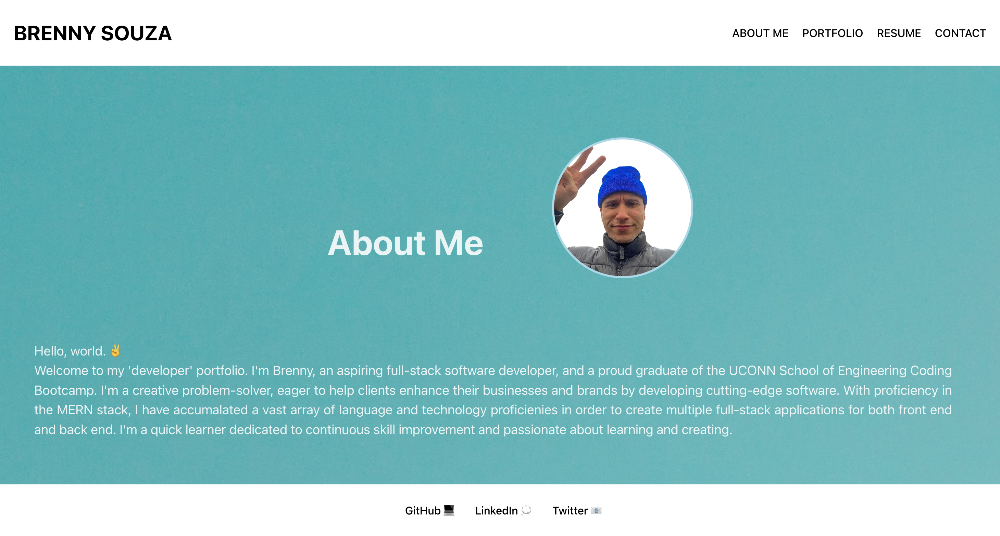

# PORTFOLIO REACT

## Description
This is the offical portfolio of aspiring junior developer, Brenny Souza. 

## Table of Contents
* [Description](#description)
* [Installation](#installation)
* [Usage](#usage)
* [Licenses](#license)
* [Badges](#badges)
* [Credits](#credits)
* [Tests](#tests)
* [Questions](#questions)

## Installation
This site utilizes the react framework and can be accessed by the site link. It is interactive with javascript, and styled with css. React helps provide a framework for the website and gives routes for all the site pages found in the nav bar.

## Usage
[Github Repo](https://github.com/brennysouza/portfolio-react)

[Netlify Deployed Site]()

## License

## Badges
NA

## Credits
- Help with the hook for the header typewriter effect came from the Youtube Channel, Olli. The specific video can be found [here](https://www.youtube.com/watch?v=4iN2GGq5SgA) titled: "Build a Typing Effect with React (2023)".
- Some file and folder structuring help came from the React Module from class. 

## Tests
NA

## Questions
Feel free to reach me at any time by these two contact methods below should you have any additional questions, comments, or concerns!

- GitHub Username: [brennysouza](https://github.com/brennysouza/portfolio-react)
- Email: [brennysouza@protonmail.com](brennysouza@protonmail.com)

